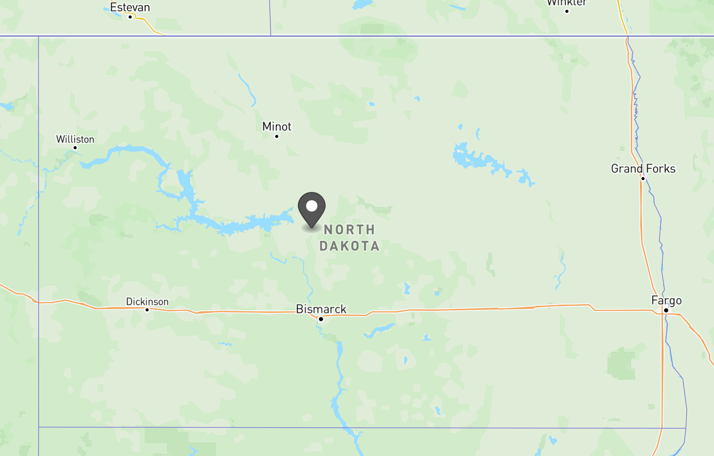

# Christopher J. Seeger

I'll add more to this page later, but here are a few facts about me. 
I have worked at ISU for over 25 years. I am originally from North Dakota. 
You can see the map below for details on where in ND I grew up.

My professional interests include data science, developing participatory mapping applications and doing work with geospatial data. My past research has included workign with assessments of the built environment and physical activity and transportation networks. 

My non-work activiteis include spending times in the outdoors, woodworking and traveling.

Map of where I grew up.

