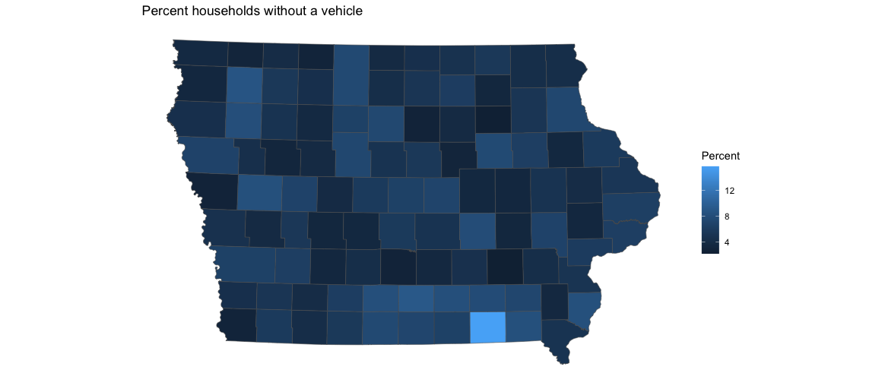
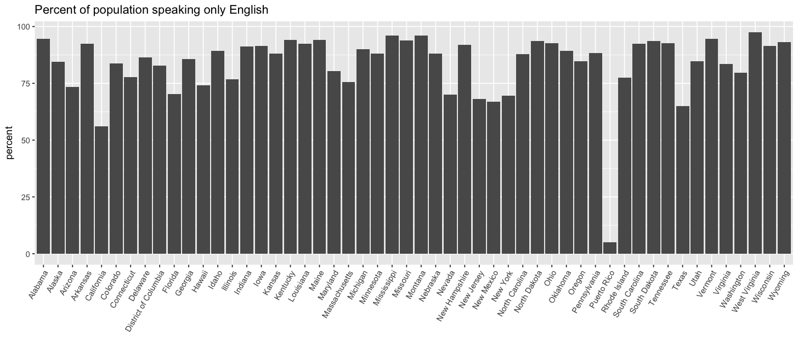
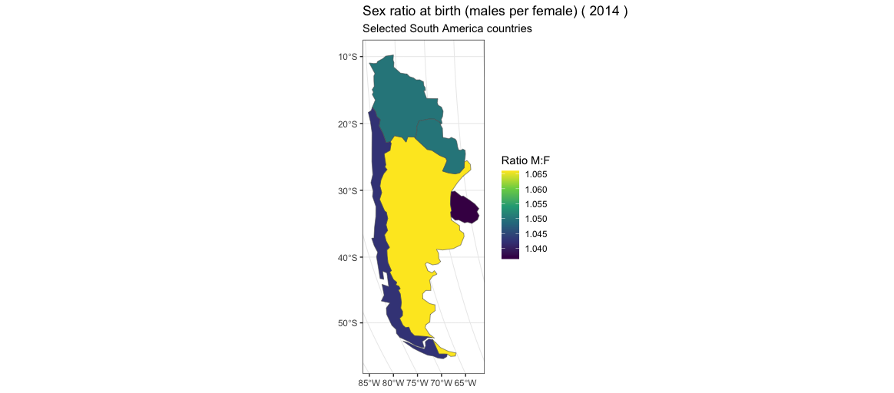

## Assignment 3

#### Map 1: Households no vehicle
Households without a vehicle. I used variables ... and then did a mutate

#### Plot 2: Percent of the population that speak only English.
A basic bar plot, but I had to rotate the lables for the states to get them to fit. 
The R file for this is in the lecture repo.

#### Map 3: Sex ratio at birth (males per female) 2014
I use the library(idbr) for this project. 
See otherCountries.R file in Lecture 6

