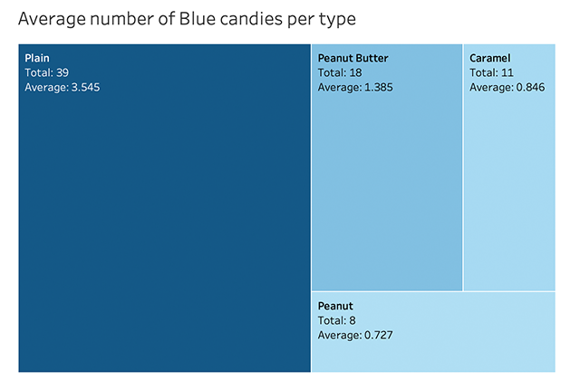
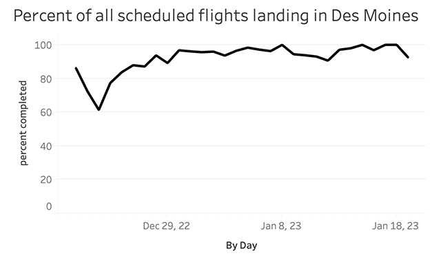

# Exercise 1b

### Candy Data Observation
I looked at the average number of blue candies in each type of bag.
The image created was produced in Tableau.

### Des Moines Flight Data
I calculated the percent of scheduled flights that landed and made a line chart in Tableau.

