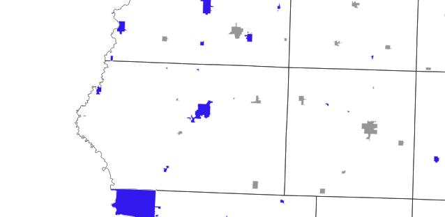

# Exercise 2b

### Cities where less than 75% of the total population is over the age of 18.
I started out with a shapefile of the cities in Iowa that contained an attribute or count of the population over age 18 and the total population of the city. I created a new attribute that calculated the percent of the city population over age 18. I then selected all the cities that have less than 75% of their population over age 18. Once selected, I made a new attribute and set the selected cities to be 'yes.' Inverting the selection allowed me to update the calculation to identify those over 75% as a 'no' value. Finally I set the symbology to show all cities marked 'yes' in blue and the rest in a grey.

#### This is not my map. It is an example of an external link to a map of Iowa I found on the Web.

